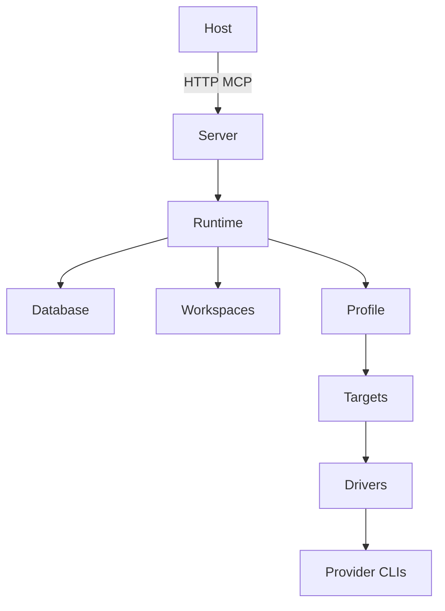

# Project Overview

OpenMCP is a loopback HTTP orchestration daemon. It exposes durable project
jobs through MCP. Jobs use built-in workflows, profiles, named contexts,
isolated worktrees, chained commits, and explicit integration.

## Repository Structure

```text
src/openmcp/
  backends/           provider-specific CLI adapters and classification
  backend_runner.py   direct Python invocation compatibility service
  cli.py              serve and doctor commands
  config.py           targets, profiles, and CLI args
  database.py         SQLite state and migrations
  drivers.py          internal provider dispatch
  models.py           public structured results
  overlays.py         ignored-file overlay handling
  planning.py         immutable execution-plan snapshots
  processes.py        cross-platform process-group lifecycle
  runtime.py          scheduler, contexts, retries, and integration
  server.py           MCP tools, resources, and daemon lifecycle
  workflows.py        built-in workflow definitions and validation
  workspaces.py       Git isolation and integration
tests/
  test_smoke.py
  test_orchestration.py
  test_live_backends.py
```

## Development Commands

```bash
uv sync --all-extras
uv run pytest
uv run pytest -m live
uv run openmcp doctor
uv run openmcp serve
uv build
```

## Public Contract

Tools:

- `status`
- `reload`
- `doctor`
- `project_register`
- `task_guide`
- `job_submit`
- `job_wait`
- `job_cancel`
- `job_retry`
- `job_integrate`

Built-in workflows:

- `implement` for isolated changes and explicit integration
- `review` for non-committing code review
- `consult` for non-committing analysis

`job_submit` accepts `profile` and `parent_job_id`; `job_wait` accepts
`include_stage_outputs`. Task guides recommend workflows and profiles, not
specific targets. Internal provider identities remain configuration-only,
although configured target health is visible through the targets resource.

## Architecture



Data flow:

1. Register a clean Git project.
2. Submit a workflow and profile.
3. Resolve the workflow to the profile's target list.
4. Select a healthy configured target.
5. Execute inside an isolated worktree.
6. Persist output, context, events, and commits.
7. Chain review or fix jobs through parents.
8. Integrate the latest approved write job explicitly.

## Target execution policy

Targets own provider execution settings: `model`, `backend_profile`,
`reasoning`, `system_prompt`, `isolated`, `read_only`, and backend-specific
argv `args`.
Drivers compile those fields into transport-only backend calls. Target args are
individual argv tokens, never shell syntax; the reserved `--` token and Codex
workspace overrides are rejected. Target policy and args are captured in the
immutable execution plan for each job.

## Pi Isolation

Targets can set `isolated`, `read_only`, and `system_prompt`. Isolated Pi
invocations disable context files, extensions, skills, prompt templates, and
project approvals, and cannot explicitly load those resources through `args`.
Read-only targets receive only `read`, `grep`, `find`, and `ls` tools. Normal Pi
targets receive `--approve` after configurable args so approval cannot be
turned off by target ordering.

Sage and Sentinel default to `gpt-5.6-sol`. Configuration can override models.

## Profiles

`[profiles.<name>]` maps workflows directly onto targets or ordered target
lists. The daemon uses `default_profile` when submissions omit one. Profiles
support cost, quality, latency, offline, or project-specific policies without
changing workflows. Lists provide failover without another configuration layer.

## Code Conventions

- Use `from __future__ import annotations`.
- Use `@dataclass(slots=True)` for parameter types.
- Define `__all__` in package modules.
- Use `get_logger()`. Never print from library code.
- Keep provider names inside drivers and configuration.
- Preserve structured MCP result models.

## Testing

Offline tests cover command construction, selection, persistence, worktree
isolation, job chains, cancellation, migration, and integration. Live tests
require provider CLIs. Normal test runs skip live markers.

## Security Guardrails

- Never store credentials in this repository.
- Never log API keys or environment secrets.
- Review every subprocess command change.
- Review classifier and scheduler retry changes.
- Never modify Antigravity settings to select a model; pass `agy --model` per invocation.
- Do not persist or mutate provider settings outside target configuration and
  the driver compilation boundary.
- Update `uv.lock` only through `uv lock`.
- Keep Sentinel and Sage read-only by default.
- Keep HTTP bound to loopback by default.
- Treat worktrees as Git isolation, not a security sandbox: permission-bypassing write agents can access the host and parent repository.

## Adding targets and profiles

Targets configure providers, models, policies, and backend argv options.
Profiles map built-in workflows directly onto targets. Configuration and project
selection reload for new submissions, while submitted jobs retain their
immutable plan. OpenMCP does not load project-defined workflows.
