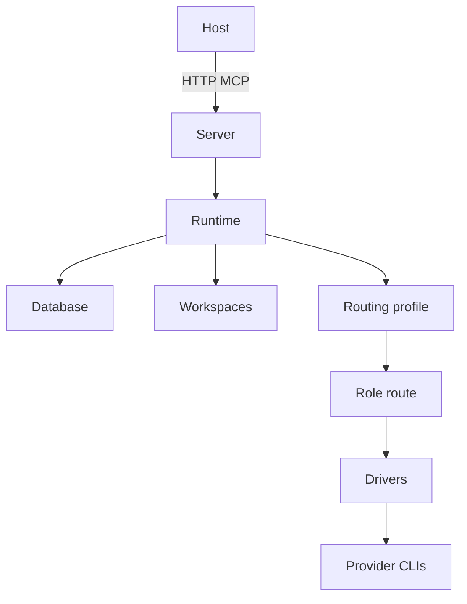

# Project Overview

OpenMCP is a loopback HTTP orchestration daemon. It exposes durable project
jobs through MCP. Jobs use role workflows, routing profiles, named contexts,
isolated worktrees, chained commits, and explicit integration.

## Repository Skill

Use `.agents/skills/openmcp-orchestrate/SKILL.md` for OpenMCP orchestration.

## Repository Structure

```text
src/openmcp/
  backends/       CLI adapters and shared classification
  cli.py          serve and doctor commands
  config.py       targets, routes, and routing profiles
  database.py     SQLite state and migrations
  drivers.py      internal provider dispatch
  models.py       public structured results
  runtime.py      scheduler, contexts, retries, and integration
  server.py       MCP tools and resources
  workflows.py    built-in and project workflow loading
  workspaces.py   Git isolation and integration
tests/
  test_smoke.py
  test_orchestration.py
  test_live_backends.py
```

## Development Commands

```bash
uv sync --all-extras
uv run pytest
uv run pytest -m live
uv run openmcp doctor
uv run openmcp serve
uv build
```

## Public Contract

Tools:

- `project_init`
- `project_register`
- `task_route`
- `job_submit`
- `job_wait`
- `job_cancel`
- `job_retry`
- `job_integrate`

Built-in workflow permissions:

- `read`
- `write`

`job_submit` accepts `routing_profile` and `parent_job_id`. Public resources
expose role nicknames. Internal provider identities remain configuration-only.

## Architecture



Data flow:

1. Register a clean Git project.
2. Submit a role workflow and routing profile.
3. Resolve the role through that profile.
4. Select a healthy configured target.
5. Execute inside an isolated worktree.
6. Persist output, context, events, and commits.
7. Chain review or fix jobs through parents.
8. Integrate the latest approved write job explicitly.

## Pi Isolation

Targets can set `isolated`, `read_only`, and `system_prompt`. Isolated Pi
invocations replace the default system prompt. They disable context files,
extensions, skills, prompt templates, and project approvals. Read-only targets
receive only `read`, `grep`, `find`, and `ls` tools.

Sage and Sentinel default to `gpt-5.6-sol`. Configuration can override models.

## Routing Profiles

`[routing_profiles.<name>]` maps logical roles onto route IDs. The daemon uses
`default_routing_profile` when submissions omit one. Profiles support cost,
quality, latency, offline, or project-specific policies without changing
workflow definitions.

## Code Conventions

- Use `from __future__ import annotations`.
- Use `@dataclass(slots=True)` for parameter types.
- Define `__all__` in package modules.
- Use `get_logger()`. Never print from library code.
- Keep provider names inside drivers and configuration.
- Preserve structured MCP result models.

## Testing

Offline tests cover command construction, routing, persistence, worktree
isolation, job chains, cancellation, migration, and integration. Live tests
require provider CLIs. Normal test runs skip live markers.

## Security Guardrails

- Never store credentials in this repository.
- Never log API keys or environment secrets.
- Review every subprocess command change.
- Review classifier and scheduler retry changes.
- Never write Antigravity settings outside `_patch_model()`.
- Update `uv.lock` only through `uv lock`.
- Keep Sentinel and Sage read-only by default.
- Keep HTTP bound to loopback by default.

## Adding Targets and Roles

Targets select internal providers and models. Routes select target pools.
Routing profiles map public roles onto routes. Add a workflow only when a new
execution shape is required.
